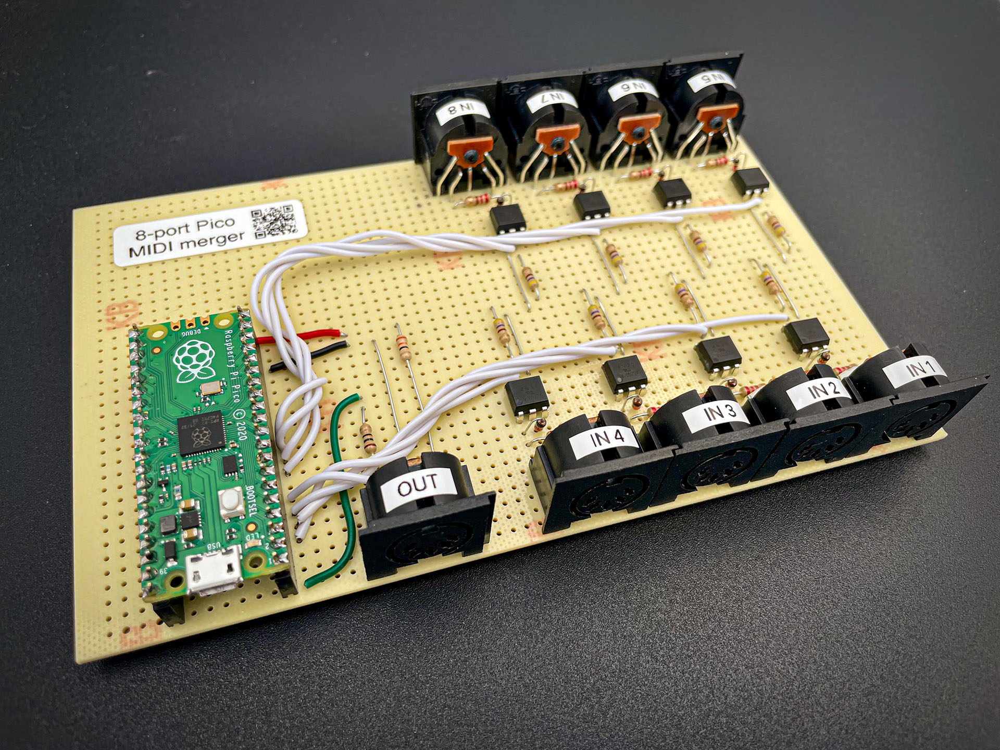
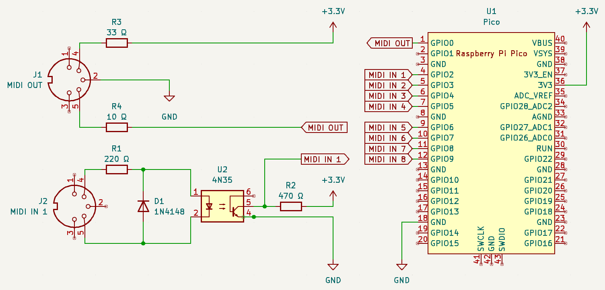

# 8-port MIDI merger using Raspberry Pi Pico

Low latency 8-port MIDI merger based on a [Raspberry Pi Pico](https://www.raspberrypi.com/products/raspberry-pi-pico/).

## Schematic

The circuit consists in 8 standard MIDI inputs and 1 MIDI output, rated for 3.3V.

It's powered by the Raspberry Pi Pico via USB that provides 3.3V. MIDI IN 1-8 are connected to GPIO2-9. MIDI OUT is connected to UART0 TX (GPIO0).

The MIDI inputs are built around the 4N35 optocoupler. Other MIDI input designs for the Raspberry Pi Pico that use other optocoupler references would work as well.

## Build

The circuit can be built on a zero PCB or a breadboard.

Components list:
* 1x Raspberry Pi Pico
* 2x 20-pin PCB connectors
* 9x 180° DIN sockets
* 8x 4N35 optocouplers
* 8x 1N4148 diodes
* 8x 220 ohm resistors
* 8x 470 ohm resistors
* 1x 33 ohm resistor
* 1x 10 ohm resistor

## Implementation

The 8-port merger code is written in C++ using [SerialPIO](https://arduino-pico.readthedocs.io/en/latest/piouart.html). Working directly at the serial level instead of using a MIDI library allows to achieve the lowest latency possible by routing the incoming MIDI messages directly to the output since the first byte and to properly handle interleaved real-time messages.

## Merging rules

The merging rules are based on the [MERGE-8 by Kenton UK](https://kentonuk.com/product/merge-8/).

### MIDI Clock

When power is first applied, no input is defined as a master and all clock messages from all inputs will be passed until one input is defined as a master.

The most recent input to receive a START command (or Song Position Pointer=0 followed by CONTINUE) will become the clock master.

That input continues to be the clock master until another input satisfies the above condition.

### Active Sensing

The first input to receive an Active Sensing message will become the Active Sensing master. Active sensing messages from that input will be passed to the output, any active sensing messages received at other inputs will be ignored. An input will stay as Active Sensing master until no more Active Sensing messages are received at that input for a period of around 5 seconds. Then another input has the opportunity to become the Active Sensing master.

### SysEx Messages

While any input is handling a SysEx message it becomes the SysEx master, and SysEx messages from all other inputs will be locked out until the message at the master input has finished.

SysEx messages may be terminated either with an End Of SysEx command (F7) or with any other status command.
